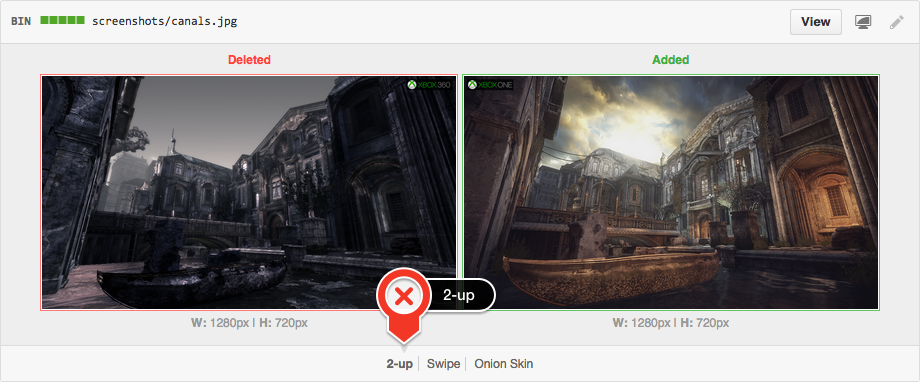
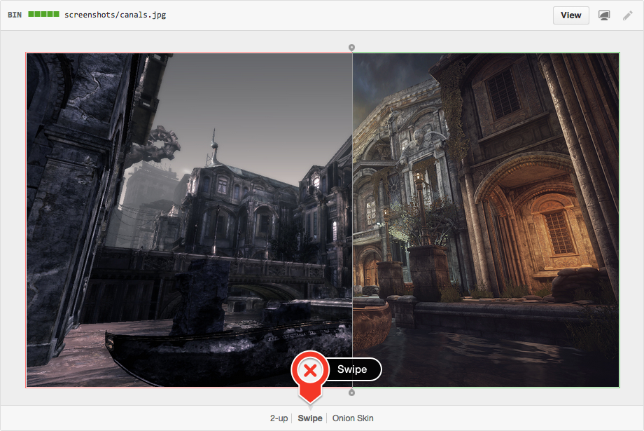
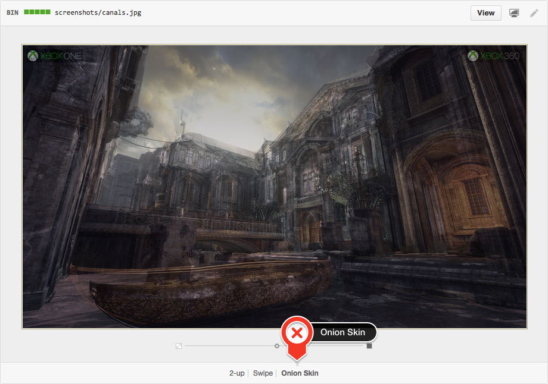

## Gears of War: Ultimate Edition Screenshot Comparison

**Gears of War: Ultimate Edition** was announced today at E3 and the website went live with a ton of great content. The [before/after screenshot comparison demonstrating the improved graphics](https://gearsofwar.com/en-us/ultimate-edition/before-and-after) plus promises 1080p/60fps is enough to make anyone drool.

**Did you know:** You can recreate the image diff/swipe functionality to compare images by using Git and taking advantage of GitHub's lesser-known [image diff viewing functionality](https://help.github.com/articles/rendering-and-diffing-images/#viewing-differences)? Try it for yourself by checking out [the first pull request in this repository](https://github.com/leereilly/gears-of-war-ultimate-edition-comparison/pull/1/files).

### Viewing Modes

There are currently three different viewing modes...

#### 2-up

**2-up** is the default mode; it gives you a quick glimpse of both images. In addition, if the image has changed size between versions, the actual dimension change is displayed. This should make it very apparent when things are resized, such as when assets are upgraded to higher resolutions.

#### Swipe

**Swipe** lets you view portions of your image side by side. Not sure if colors shifted between different versions? Drag the swipe slider over the area in question and compare the pixels for yourself.

#### Onion Skin

**Onion** Skin really comes in handy when elements move around by small, hard to notice amounts. Did an icon shift two pixels to the left? Drag the opacity slider back a bit and notice if things move around.

**NB:** This functionality does not currently work on mobile views
